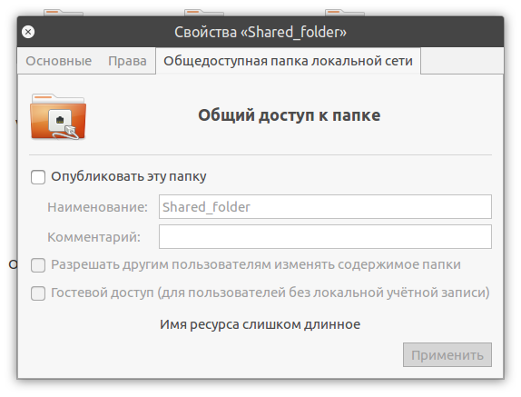
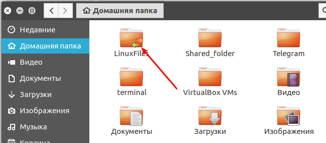
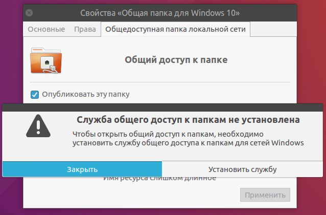
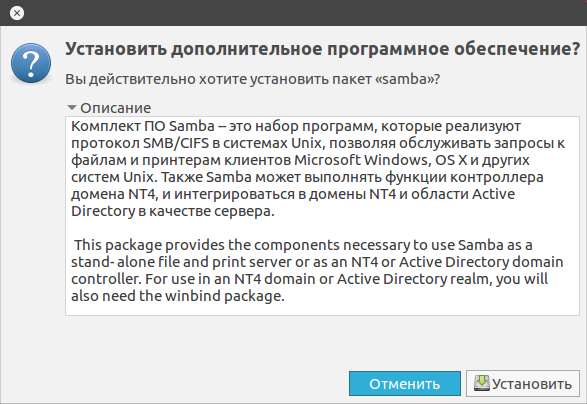
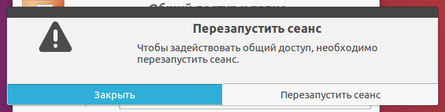
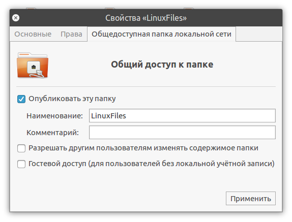
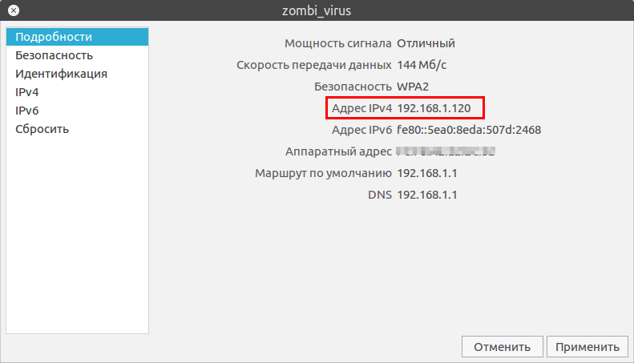
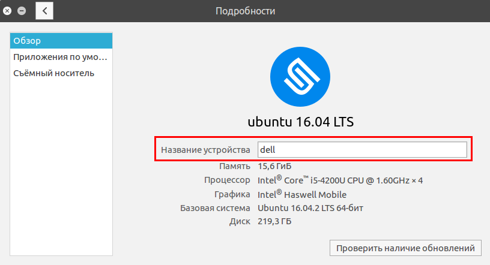
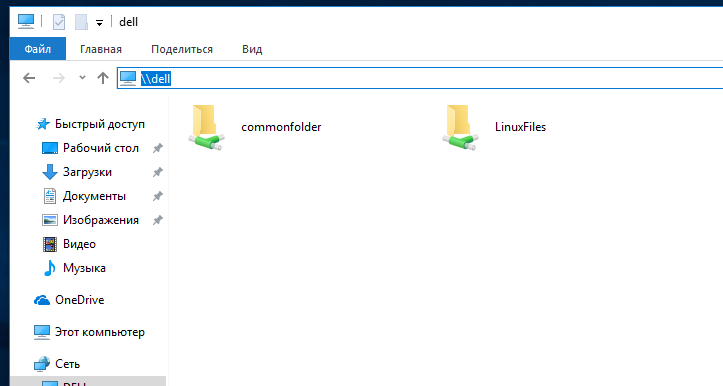
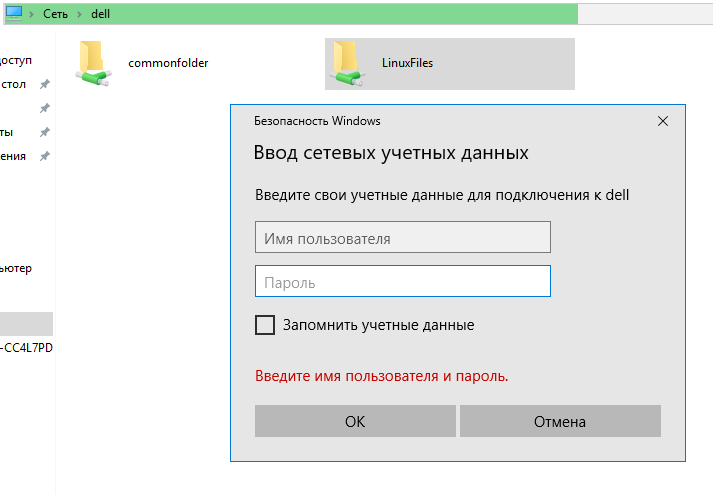

В данной статье расскажу о настройке файлового обмена между Windows и Ubuntu. Мы научимся расшаривать папки (каталоги) в Ubuntu и подключаться к ним из Windows 10 и наоборот. В этой статье все действия мы будем выполнять без использования терминала.

<!-- more -->

Этой статьей я хочу развеять предрассудки, что шарить папки на Ubuntu очень сложно. Так как же расшарить папку в Ubuntu?

# Настройка общего доступа папки в Ubuntu и подключение к ней из Windows.

Открываем файловый менеджер (Nautilus). Выбираем папку, которую хотим расшарить другим пользователям в локальной сети. Кликаем по ней правой кнопкой мыши, в контекстном меню выбираем "Свойства" и переходим на вкладку "Общедоступная папка по локальной сети":



Если проставить галочку "Опубликовать эту папку" и нажать кнопку "Применить", то наша папка станет доступна другим пользователям в локальной сети. И у эта папка будет подсвечена значком общего доступа:



**Но есть нюансы. Не спешите закрывать статью.**

Если мы это сделаем в первый раз, то система нам радушно предложит установить "Службу общего доступа к папкам":



Соглашаемся и жмём "Установить службу", появится окно, непосредственно, с установкой пакета Samba:



Устанавливаем и соглашаемся на перезапуск сеанса:



## Давайте разберёмся подробнее с открытием общего доступа к папке.

Создадим какую-нибудь папку, к примеру, назовём её LinuxFiles. Проставим галочку "Опубликовать эту папку" и нажать "Применить":



В поле "Наименование" можно вписать имя сетевого ресурса, как оно будет отображаться у нас в сети.

К примеру, мы создаём название каталога с пробелами и прочими символами, а здесь, в поле "Наименование" указываем нормальное название сетевого ресурса латинскими буквами.

## Как подключиться к расшаренной папке Ubuntu из Windows?

Для этого нам надо узнать наш **ip** или **название устройства** (hostname).

Это можно сделать в графическом интерфейсе через "Параметры" системы.

В пункте "Сеть" посмотреть подробности вашего подключения:



В пункте "Подробности" (О системе):



Тоже самое можно посмотреть и в терминале, выполнив следующие команды:

```bash
ifconfig
hostname
```

После чего в Windows подключаемся, введя в адресной строке Проводника два обратных слеша `\\`, а затем ip адрес или имя устройства Ubuntu:



Отобразятся все расшаренные каталоги на Ubuntu машине. Но если мы попытаемся зайти в нашу папку LinuxFiles, то получим ошибку доступа:



