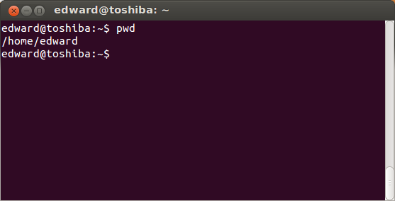
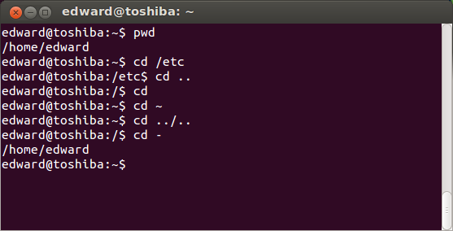
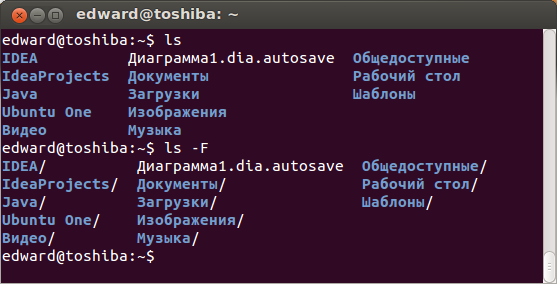

В этой статье пойдет речь про команды навигации в терминале.

<!-- more -->

> Решил написать несколько статей на тему терминала Linux. Постараюсь объяснять наиболее доходчиво.

*Комментирование приветствуется.*

# Что из себя представляет корневая файловая система Linux?

Прежде, чем приступить к командам навигации в терминале, поговорим о директориях в Linux. Здесь нет дисков **C:**, **D:** и прочих.

*Когда я начинал свой путь в Linux, для меня это было наиболее непонятно. Поэтому хочу пояснить этот момент.*

Неважно, на сколько разделов вы разобьёте ваш диск, в системе будет: 
> **"/"  - корневая директория**

Затем идут все остальные каталоги, которые служат для своих целей.

- **/home** - хранит каталоги пользователей, в которых можно, как правило, выполнять большинство действий без пароля администратора. Ваш домашний каталог находится по адресу: `/home/Ваше_Имя_пользователя`.

- **/mnt** и **/media** -  в эти каталоги монтируются другие физические диски, флешки и прочие носители информации.

- **/media** - сюда монтируются диски, флешки, то есть, в этом каталоге создается папка с названием вашего электронного носителя.

Остальные каталоги системные, рассказу о них стоит выделить целую статью.

**Перейдем к командам в терминале.**

# Команды навигации в терминале.

Когда вы открываете терминал в Ubuntu, то вы находитесь в своем домашнем каталоге:



Значок `~ (тильда)` - означает домашний каталог текущего пользователя.

Чтобы узнать текущую директорию (*отобразить полный путь к текущей директории*),достаточно набрать команду в терминале:

```bash
pwd
```

Выполнение данной команды представлено на скриншоте выше.

## Для навигации в терминале используется команда "cd" (англ. change directory - изменить каталог).

Сначала пишется команда cd, а затем путь, куда нужно перейти.

Вот так выглядит переход в каталог **/home**:

```bash
cd /home
```

Но это не всё, что можно делать с помощью команды `cd`:



Перейти в директорию уровнем выше:

```bash
cd ..
```

Перейти в директорию двумя уровнями выше:

```bash
cd ../..
```
Перейти в домашнюю директорию вашего пользователя:

```bash
cd
```
Перейти в домашнюю директорию пользователя user_name:

```bash
cd ~user_name
```
Перейти в директорию, в которой находились до перехода в текущую директорию:

```bash
cd -
```

## Следующая команда, используемая в навигации - "ls" (сокращение от англ. list).

Если ввести в терминале:

```bash
ls
```

отобразится содержимое текущей директории:



Отобразить содержимое текущей директории с добавлением к именам символов, характеризующих их тип:

```bash
ls -F
```

Показать детализированное представление файлов и директорий в текущей директории:

```bash
ls -l
```

Показать скрытые файлы и директории в текущей директории:

```bash
ls -a
```

Ключи можно комбинировать вместе:

```bash
ls -la
```

Кроме того, у команды **ls**  очень много других ключей, которые можно посмотреть, выполнив команду:

```bash
ls --help
```

# Автодополение названий директорий в терминале.

Когда вы вводите команду **cd**, вам необязательно вводить полностью имя директории, достаточно нажать на клавиатуре клавишу "TAB", произойдет **автодополнение названия каталога**.

Если имя не заполнилось, значит, есть еще один каталог с таким названием. Нажав дважды клавишу "TAB", выведется список с каталогами, которые имеют в своём имени начальные буквы, которые вы ввели.

Если список огромнейший, то для отмены его просмотра нажмите клавишу N.

Это касается не только "cd", но и других команд. Например, когда вы хотите отредактировать какой-то файл. Вы выполнили команду ls, увидели, что у файла имя состоит из 30 знаков, то достаточно ввести первые буквы его имени и нажать клавишу "TAB" и произойдет автодополнение.

___
Это основные команды навигации в терминале Linux.
