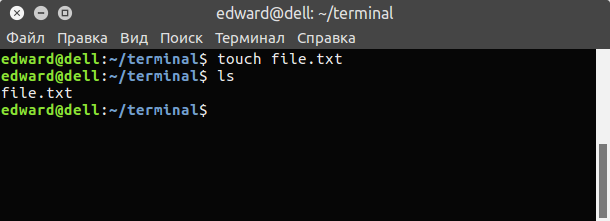
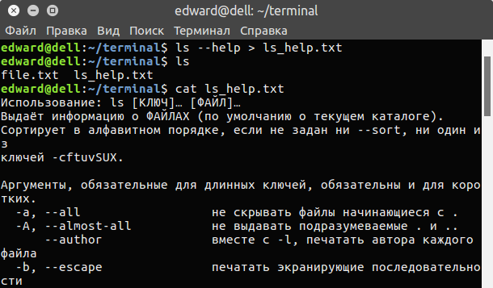
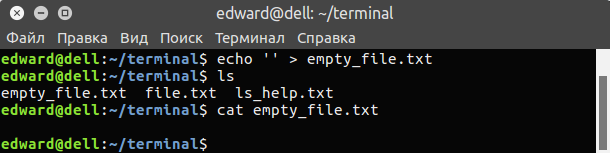
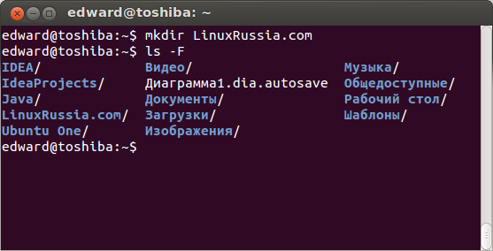
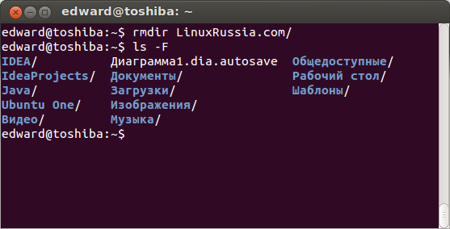
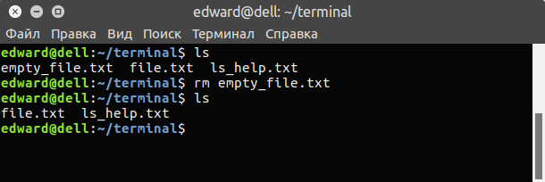
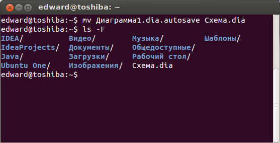
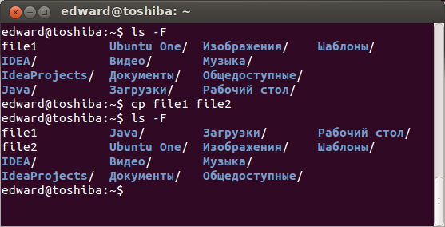
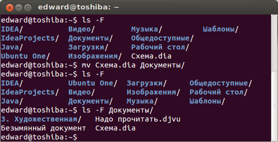
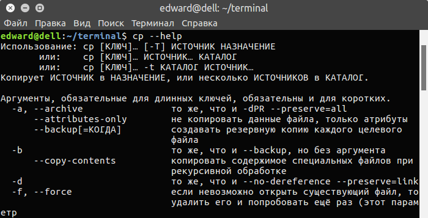

C навигацией разобрались, теперь научимся создавать, удалять, копировать, перемещать файлы и директории (каталоги) в терминале Linux.

<!-- more -->

*Комментирование приветствуется.*

# Создание файлов и директорий в терминале Linux.

## Создание текстовых файлов в терминале Linux.

Текстовый файл в терминале Linux можно создать тремя способами.

### 1. С помощью команды touch:

Вводим команду touch, затем путь и название нового файла.

```bash
touch /путь/к/файлу/название_файла
```

Например, создадим текстовый файл в текущей директории с именем file.txt:

```bash
touch file.txt
```



### 2. С помощью перенаправления стандартного потока вывода любой команды.

*О перенаправлении стандартных потоках вывода в файл более подробно будет рассказано в одной из следующих статей о терминале Linux.*

Создать файл можно также перенаправлением вывода любой команды в файл.

В общем виде команда будет следующей:

```bash
какая_нибудь_команда > /путь/к/файлу/наименование_файла
```

То есть, команда с выводом, затем галочка вправо >, означающая перенаправление вывода команды в файл и путь к файлу.

Например, перенаправим вывод справки команды ls в файл, который будет создан (*а если такой файл есть, то он будет полностью перезаписан*):

```bash
ls --help > ls_help.txt
```



Но это мы создали не пустой файл, а если хотим создать пустой, то воспользуемся командой **echo** c переданной ей пустой строкой (две одинарных ковычки) и перенаправим это в файл:

```bash
echo '' > file
```



### 3. С помощью любого текстового редактора, консольного или с графическим интерфейсом.

Передаем команду запуска любого текстового редактора и путь к файлу.

Самый простой консольный текстовый редактор это **nano**:

```bash
nano nano_file.txt
```

Или с помощью текстового редактора с графическим интерфейсом, который установлен в Gnome по умолчанию:

```bash
gedit gnome.txt
```

*Про манипуляции с текстом более подробно в одной из следующих статей о терминале Linux.*

## Создание директорий (каталогов) в терминале Linux.

Создание каталогов выполняется командой **"mkdir"** (от англ. **m**a**k**e **dir**ectory):

```bash
mkdir dir_name
```



Создать директорию с именем "dir1":

```bash
mkdir dir1
```

Создать две директории одновременно:

```bash
mkdir dir1 dir2
```

Создать дерево директорий:

```bash
mkdir -p /dir1/dir2
```

# Удаление файлов и директорий в терминале Linux.

## Удаление директорий (каталогов) в терминале Linux.

Для удаления директорий используется команда **"rmdir"** (от англ. **r**e**m**ove **dir**ectory):

```bash
rmdir dir_name
```



Удаляются директории аналогично, как и создаются. Такие же команды.

## Удаление файлов в терминале Linux.

Для удаления файлов используется команда **"rm"** (от англ. **r**e**m**ove).

Работает очень просто, пишете команду rm и путь к файлу, который хотите удалить:



Удалить файл с именем "file1":

```bash
rm file1
```

> Но команда "rm" позволяет удалять не только файлы, но и директории (каталоги) вместе с их содержимым.

Удалить директорию с именем "dir1" и рекурсивно всё её содержимое:

```bash
rm -r dir1
```

Удалить две директории и рекурсивно их содержимое:

```bash
rm -r dir1 dir2
```

Также можно добавить параметр **-f**, который означает, что при удалении не будет запрашиваться подтверждение на удаление. Команды будут выглядеть так:

```bash
rm -f file1
rm -rf dir1
```

# Перемещение и переименование файлов и директорий в терминале Linux.

Для перемещения и переименовывания файлов и директорий (каталогов) используется команда **"mv"** (от англ. **m**o**v**e).

Всё очень просто. Чтобы переименовать файл, выполняем команду:

```bash
mv название_файла новое_название
```



Чтобы переместить файл:

```bash
mv название_файла путь/
```



# Копирование файлов и директорий в терминале Linux.

Для копирования используется команда **"cp"** (от англ. **c**o**p**y).

Скопировать файл file1 и назвать его file2:

```bash
cp file1 file2
```



Копировать директорию dir1 в директорию dir2:

```bash
cp -a dir1/ dir2/
```

Копировать файл с именем file1 в директорию c именем dir1:

```bash
cp file1 dir1/
```

# Справка о командах.

У каждой команды присутствует множество параметров, чтобы узнать их, просто наберите команду и параметр --help:



Например:

```bash
rm --help
touch --help
```